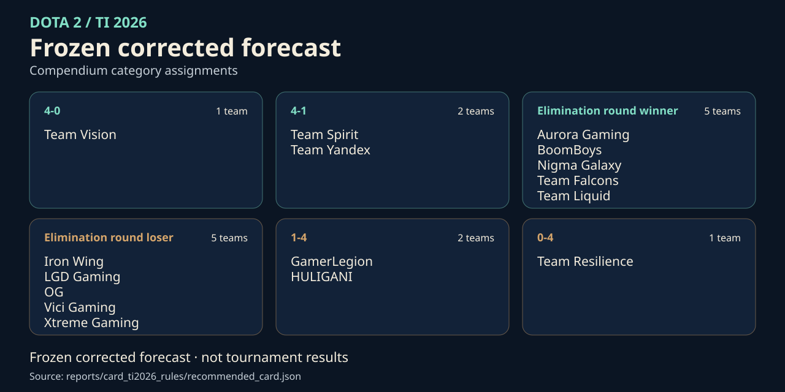
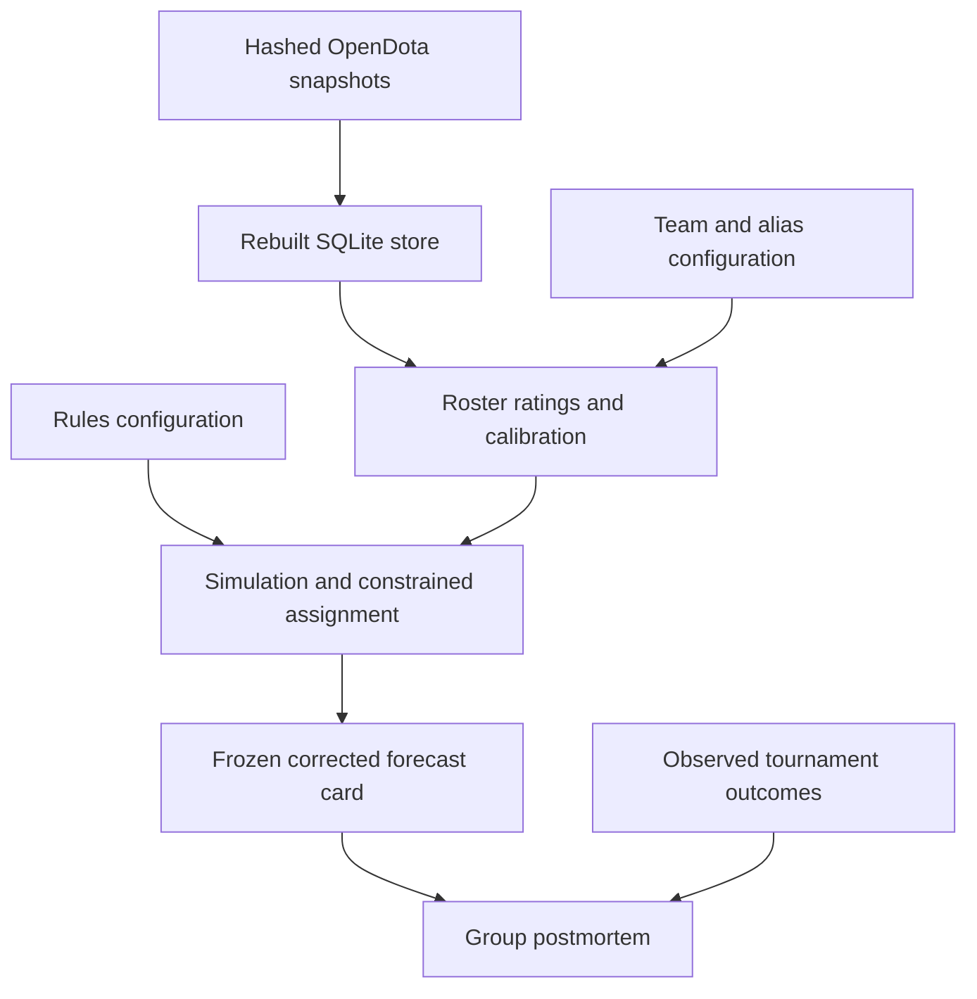

# ti26 — reproducible forecast retrospective

Research pipeline for The International 2026, Dota 2's annual world championship. It traces a compendium prediction card—a one-shot, locked assignment of teams to placement categories—from match data through ratings and simulation to tournament postmortems. Its contribution is an auditable chain from inputs to decisions, including negative results. Maintenance is retrospective only; repeat-event predictive skill remains unproven.

[](reports/card_ti2026_rules/recommended_card.json)

*The frozen corrected card matches a plain strength sort, and some assignments change across simulation seeds; see [card provenance](reports/card_ti2026_rules/card_provenance.md) for both diagnostics.*

## Verify a retained run

Use a full-history checkout. Setup may download the locked dependencies; the verification command reads committed inputs offline. Release verification targets Python 3.13, while the package floor is declared in [pyproject.toml](pyproject.toml).

```bash
uv sync --locked --python 3.13
.venv/bin/python -m ti26.cli_provenance verify-run \
  --bundle reports/runs/frozen-output-oracle-baseline/61c63f4aa32c573cdbc7e4abe48e08308801f1ff3cb8e5629a4ae446d5d22b6b \
  --repo-root . --at-source-revision
```

This checks the bundle's declared inputs as Git blobs at its recorded source revision and checks the current output bytes. It does not attest original execution or undeclared runtime dependencies. The [reproduction guide](docs/reproduce.md) covers store reconstruction, postmortem replay, artifact bindings, and the optional full forecast replay.

## Evidence and limits

| Evidence | What it supports |
|---|---|
| [Frozen corrected forecast](reports/card_ti2026_rules/recommended_card.json) and [card provenance](reports/card_ti2026_rules/card_provenance.md) | The retained Swiss-stage assignment and the assumptions used to generate it. Map calibration does not establish card calibration. The [group replay manifest](reports/postmortems/group-replay.manifest.json) binds this card for retrospective evaluation, not original-run provenance. |
| [Historical bundles](reports/runs/) | Source revisions, declared inputs, output hashes, producer arguments, and recorded randomness. New descriptors bind the lock; older manifests retain their original scope. |
| [Group postmortem](reports/card_postmortem.md), [playoff postmortem](reports/playoff_postmortem.md), and [replay manifests](reports/postmortems/) | Retrospective diagnostics. Group results feed playoff strengths, so they are not independent replications; replay manifests do not prove original execution. |
| [External playoff cards](data/ti2026_playoff_cards.yaml) and frozen [LLM evidence](predictions-from-llms/) | Owner-generated comparisons with consumer AI apps, not a controlled model benchmark. Prompts and settings are not recorded; see [data sources](docs/data-sources.md). |
| [Known weaknesses](docs/ti26/2026-08-08-known-weaknesses.md) | Raw ratings did not clear the constant baseline; calibrated Glicko cleared the narrowly registered D3b gate. Simulated category marginals condition on point strengths and assumed rules, without propagating Glicko rating-deviation uncertainty. |
| [Series scoring](reports/series_score/series_score.md) | Positive historical diagnostic; shared tournament conditions limit its nominal significance calculation. |

Registered gates remain immutable. Diagnostics cannot promote, demote, or change the shipping card.

## How the group forecast artifacts connect



The [OpenDota explorer](src/ti26/data/opendota.py) and [Steam news](src/ti26/data/steam_news.py) take injectable transports; release runs read pinned bytes. Roster identity follows the five-player roster rather than the organisation, internal simulation labels follow strength rank, and producers write reports before release orchestration adds bundle references.

The project layout keeps implementation in `src/ti26/`, registrations in `config/`, inputs in `data/`, generated evidence in `reports/`, and research history in `docs/`.

## Navigate the record

- [Documentation index](docs/README.md) distinguishes current guides, research evidence, specifications, and plans.
- [Correction register](docs/audits/2026-08-04-correction-register.md) records corrections to earlier unsupported claims.
- [Release checklist](docs/release-checklist.md) records the release history and continuing verification conditions.

## Contributing and reuse

Read [CONTRIBUTING.md](CONTRIBUTING.md) for mutation evidence, bound measurements, and offline checks.

Local tests deny Python socket connections and transmissions; CI isolates verification commands from the network. See the [reproduction guide](docs/reproduce.md#verification-and-limits) for details.

```bash
.venv/bin/python -m pytest -q
.venv/bin/python -m ruff check .
```

Code and original documentation use [MIT](LICENSE). Third-party data and text retain separate rights; see [data sources](docs/data-sources.md). Player identifiers are not anonymous. See the [security policy](SECURITY.md) and [citation](CITATION.cff).
