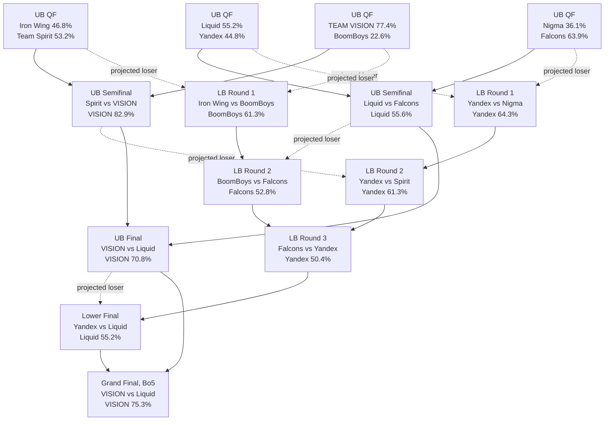

# Predicting The International 2026 Dota 2 Playoffs

## Executive summary

As of **Monday, August 17, 2026**, The International 2026 has eight teams left: **TEAM VISION, Team Liquid, Nigma Galaxy, Team Spirit, Iron Wing, Team Falcons, BoomBoys, and Team Yandex**. Valve’s official standings show TEAM VISION finishing the Swiss phase 4–0, Liquid and Nigma 4–1, and the other five eventual playoff teams reaching the Aug. 16 elimination round; Falcons, BoomBoys, Spirit, Iron Wing, and Yandex then won those elimination series. citeturn21search1turn22search12

My central forecast is unusually bullish on **TEAM VISION**. They combine the strongest recent championship résumé—DreamLeague Season 29 and the Esports World Cup—with a perfect 4–0 TI Swiss record, an 8–2 map score before the Main Event, outstanding form from Satanic and Noticed, and a quarterfinal against a BoomBoys side they have repeatedly beaten in recent meetings. citeturn24search7turn25search9turn21search1turn17search1 In the model described below, VISION has a **77% quarterfinal win probability and approximately a 61% probability of winning TI**, although that championship figure falls to about 40% in a deliberately aggressive “meta reset” sensitivity test.

The other three quarterfinals are substantially less certain. My predictions are **Team Spirit 53% over Iron Wing**, **Team Liquid 55% over Team Yandex**, and **Team Falcons 64% over Nigma Galaxy**. Liquid–Yandex is particularly dangerous: Yandex leads their relevant six-month head-to-head 3–2 in series and 7–6 in maps, including the PGL Wallachia Season 7 grand final, but Liquid won their TI meeting 2–1 on Aug. 14 and entered Shanghai directly after winning 1win Essence II with a 3–0 grand-final sweep of Falcons. citeturn17search2turn24search4turn25search3turn21search0

A critical data caveat applies to the official bracket requirement. **Valve confirms the Aug. 20–23 Main Event, Shanghai venue, eight-team double-elimination structure and official Swiss standings, but the text-indexed version of Valve’s current bracket still renders every Main Event slot as “tbd.”** citeturn19search0turn19search4turn21search5 The Aug. 20 quarterfinal pairings were announced after the Aug. 16 elimination round by the official TI social account and are simultaneously reflected by current tournament trackers; I therefore use those pairings, but I do **not** mislabel the dynamically unavailable Valve bracket rows as directly retrievable official-site data. citeturn22search8turn22search12turn22search1 Downstream opponents are necessarily TBD until the quarterfinals are played.

The tournament is being played on **Gameplay Patch 7.41e**, released by Valve on July 30. Valve’s news index still lists 7.41e as the latest gameplay patch as of Aug. 17. citeturn19search1 The current TI meta is relatively broad but has pronounced priority picks: Earth Spirit has been among the most contested heroes, Treant Protector remains highly valued, while Necrophos, Centaur Warrunner, Hoodwink, Winter Wyvern and Undying have all had meaningful tournament presence. citeturn3search4turn16view0 This matters especially for VISION, Yandex, BoomBoys and Spirit because several of their best-performing players line up naturally with current high-value heroes.

### Forecast at a glance

| Quarterfinal | Predicted winner | Model probability | Confidence |
|---|---:|---:|---|
| Iron Wing vs Team Spirit | **Team Spirit** | **53.2%** | Low |
| TEAM VISION vs BoomBoys | **TEAM VISION** | **77.4%** | High |
| Team Liquid vs Team Yandex | **Team Liquid** | **55.2%** | Low |
| Nigma Galaxy vs Team Falcons | **Team Falcons** | **63.9%** | Medium |

Those are **series probabilities**, not map probabilities. All four Main Event quarterfinals are Bo3; the Grand Final is Bo5. The eight-team Main Event uses double elimination. citeturn22search13turn21search5

My simulated championship distribution is:

```text
TEAM VISION    ██████████████████████████████  61.2%
Team Liquid    ██████                          12.4%
Team Falcons   ████                             8.2%
Team Yandex    ████                             7.4%
BoomBoys       ██                               5.0%
Team Spirit    █                                2.5%
Iron Wing      █                                1.7%
Nigma Galaxy   █                                1.6%
```

The very large VISION championship probability is not a statement that the tournament is “61% solved.” It is a consequence of double elimination: a materially superior team can survive one bad Bo3, and VISION’s modeled gap over the field compounds across repeated series. The sensitivity section shows how quickly that advantage contracts if the apparent patch/form edge is overstated.

## Official bracket and match schedule

Valve announced TI 2026 for Shanghai with a Swiss-style Group Stage on **Aug. 13–16** followed by an eight-team Main Event on **Aug. 20–23** at the **SPD Bank Oriental Sports Center**. Valve described the Group Stage as Bo3 Swiss matches among teams with equal records: a fourth victory gave direct advancement, a fourth defeat meant elimination, and five Aug. 16 elimination series selected the other five Main Event teams. citeturn19search0turn19search4

The official final Swiss table was TEAM VISION 4–0; Liquid and Nigma 4–1; Spirit, Iron Wing, Falcons, Aurora and LGD 3–2; BoomBoys, Vici, Yandex, Resilience and GamerLegion 2–3; Xtreme and OG 1–4; HULIGANI 0–4. citeturn21search1 The subsequent elimination results were **Falcons 2–0 Vici, BoomBoys 2–0 Aurora, Spirit 2–1 Resilience, Iron Wing 2–0 GamerLegion, and Yandex 2–1 LGD**. citeturn22search12turn22search5

### Official-source status of the bracket

There is an important live-data discrepancy. Valve’s official bracket endpoint currently exposes the structure—four upper-bracket quarterfinal slots, two upper semifinals, upper final, grand final, two lower Round 1 slots, two lower Round 2 slots, lower Round 3 and lower Round 4—but its searchable text snapshot still labels the participants **“tbd.”** citeturn21search5 Likewise, the currently indexed Valve schedule is still centered on Aug. 15–16 Group Stage/elimination content. citeturn21search0turn21search2

The first-day Main Event pairings are nevertheless now established and consistently reported after the elimination round:

**Iron Wing – Team Spirit; TEAM VISION – BoomBoys; Team Liquid – Team Yandex; Nigma Galaxy – Team Falcons.** citeturn22search8turn22search12turn22search1 SportArena’s Aug. 16 report embeds/references the official TI account’s first-day schedule announcement, while current match pages independently list the same matchups. citeturn22search12turn22search4turn22search7

### Main Event schedule

Times below use **Shanghai time (UTC+8)** and **Vienna/CEST (UTC+2)**. The Aug. 20 match order is already populated; later team identities remain result-dependent. Current tournament scheduling sources place the four daily slots at 10:00, 13:00, 16:00 and 19:00 Shanghai time on the first three Main Event days, with the lower final and Grand Final on Aug. 23. citeturn22search5turn10search1

| Date | Shanghai | Vienna | Bracket slot | Matchup/status |
|---|---:|---:|---|---|
| Aug. 20 | 10:00 | 04:00 | UB quarterfinal | **Iron Wing vs Team Spirit** |
| Aug. 20 | 13:00 | 07:00 | UB quarterfinal | **TEAM VISION vs BoomBoys** |
| Aug. 20 | 16:00 | 10:00 | UB quarterfinal | **Team Liquid vs Team Yandex** |
| Aug. 20 | 19:00 | 13:00 | UB quarterfinal | **Nigma Galaxy vs Team Falcons** |
| Aug. 21 | 10:00 | 04:00 | LB Round 1 | TBD from QF losers |
| Aug. 21 | 13:00 | 07:00 | LB Round 1 | TBD from QF losers |
| Aug. 21 | 16:00 | 10:00 | UB semifinal | TBD from QF winners |
| Aug. 21 | 19:00 | 13:00 | UB semifinal | TBD from QF winners |
| Aug. 22 | 10:00 | 04:00 | LB Round 2 | TBD |
| Aug. 22 | 13:00 | 07:00 | LB Round 2 | TBD |
| Aug. 22 | 16:00 | 10:00 | UB final | TBD |
| Aug. 22 | 19:00 | 13:00 | LB Round 3 | TBD |
| Aug. 23 | 10:00 | 04:00 | LB Round 4 / lower final | TBD |
| Aug. 23 | 13:00 | 07:00 | Grand Final | TBD, Bo5 |

All matches before the Grand Final are Bo3; the final is Bo5. citeturn22search13

Valve’s Main Event seeding rules also specify the mechanisms governing the eight-team bracket and selection priority, including coin-toss priority procedures for Bo3 series. citeturn2search5

## Team state of play

### Rosters and roster stability

The following are the active TI lineups as of Aug. 17. The positional ordering is carry / mid / offlane / position four / position five.

| Team | Current TI roster | Important roster context |
|---|---|---|
| **TEAM VISION / PARIVISION** | Satanic; No[o]ne-; Noticed; 9Class; Dukalis. Coach: Puppey | Noticed permanently replaced SSS in June after successful stand-in runs; Puppey is coaching. citeturn23search0 |
| **BoomBoys / BetBoom Team** | Kiritych~; gpk~; MieRo; Save-; Kataomi` | Kiritych replaced Pure after the previous TI cycle; the current five have had most of 2026 to settle. citeturn13search2turn22search2 |
| **Iron Wing / 1w / ex-Tundra** | Pure; bzm; 33; Ari; Whitemon | This is the Tundra lineup that won Birmingham; the roster moved to 1win and competes at TI under the Iron Wing name. citeturn24search9turn22search2 |
| **Team Liquid** | m1CKe; Nisha; Ace; Boxi; tOfu. Coach: Blitz | Stable current lineup; Ace and tOfu joined the core after the previous TI cycle. citeturn25search6turn13search4 |
| **Team Yandex** | watson; CHIRA_JUNIOR; DM; Saksa; Malady | DM permanently replaced Noticed on May 24 after previously standing in; that version subsequently won BLAST Slam VII. citeturn23search3turn25search4 |
| **Team Spirit** | Yatoro; Larl; Collapse; not me; rue | May reshuffle: not me joined as position four, rue moved to five and panto left the active roster. citeturn23search6 |
| **Nigma Galaxy** | SumaiL; lorenof; Davai Lama; OmaR; GH | Major June overhaul: SumaiL returned as carry, lorenof took mid, replacing the No!ob/Rincyq configuration. citeturn23search1turn23search5 |
| **Team Falcons** | skiter; Malr1ne; ATF; Cr1t-; Sneyking | The championship core remains together; Falcons did use temporary stand-ins in earlier 2026 events because of player availability/visa issues, so those events deserve some down-weighting. citeturn22search2turn14search6turn14search10 |

The highest modeling uncertainty belongs to **Nigma** and **Iron Wing**. Nigma’s pre-June results describe a materially different team, while Iron Wing’s organization/tag changes can fragment historical databases even though the underlying five-player lineup is continuous from the successful Tundra period. citeturn23search5turn22search2

### Major results over the last six months

To avoid false precision from low-tier cups, the comparison below covers the major international events most informative for TI strength between roughly mid-February and Aug. 17, plus the final pre-TI 1win Essence II event. PGL Wallachia Season 7 was won by Yandex; ESL Birmingham by the current Iron Wing/ex-Tundra five; PGL Wallachia Season 8 by BetBoom/BoomBoys; DreamLeague 29 by PARIVISION/VISION; BLAST Slam VII by Yandex; EWC by PARIVISION/VISION; and Essence II by Liquid. citeturn24search4turn24search9turn24search6turn24search7turn25search4turn25search9turn25search6

| Team | PGL S7 | Birmingham | PGL S8 | DL29 | BLAST VII | EWC | Essence II | TI before Main Event |
|---|---:|---:|---:|---:|---:|---:|---:|---:|
| **VISION** | 9–11 | 4th | 5–6 | **1st** | 7–8 | **1st** | — | **4–0, 8–2 maps** citeturn24search4turn24search9turn24search6turn24search7turn25search4turn25search9turn21search1 |
| **Liquid** | 2nd | — | 4th | 9–12 | 5–6 | 9–12 | **1st** | **4–1, 9–5 maps** citeturn24search4turn24search6turn24search7turn25search4turn25search9turn25search6turn22search12 |
| **Yandex** | **1st** | 2nd | 15–16 | — | **1st** | 3rd | — | 2–3 Swiss; then 2–1 LGD citeturn24search4turn24search9turn24search6turn25search4turn25search9turn22search12 |
| **Falcons** | 12–14 | 7–8 | 3rd | 4th | 5–6 | 5–8 | 2nd | 3–2 Swiss; then 2–0 Vici citeturn24search4turn24search9turn24search6turn24search7turn25search4turn25search9turn25search6turn22search12 |
| **BoomBoys** | 3rd | 11–12 | **1st** | 5–6 | 3rd | 2nd | 4th | 2–3 Swiss; then 2–0 Aurora citeturn24search4turn24search9turn24search6turn24search7turn25search4turn25search9turn25search6turn22search12 |
| **Spirit** | 4th | 5–6 | 7–8 | 3rd | 7–8 | 5–8 | — | 3–2 Swiss; then 2–1 Resilience citeturn24search4turn24search9turn24search6turn24search7turn25search4turn25search9turn22search12 |
| **Iron Wing** | 5–6 as Tundra | **1st as Tundra** | 15–16 | 7–8 | 9–10 | 9–12 as 1w | 3rd | 3–2 Swiss; then 2–0 GL citeturn24search4turn24search9turn24search6turn24search7turn25search4turn25search9turn25search6turn22search12 |
| **Nigma** | — | 15–16 | — | 13–14 | — | 5–8 | group exit | **4–1, 8–2 maps** citeturn24search9turn24search7turn25search9turn25search3turn22search12 |

Three trajectories stand out.

**VISION has the strongest peak-plus-current-form combination.** PARIVISION won DreamLeague 29, then won the far more recent EWC by beating BoomBoys/BetBoom 3–1 in the final; Noticed was named EWC MVP. They then went 4–0 at TI, including a 2–0 over Spirit and a 2–0 over BoomBoys. citeturn24search7turn25search9turn21search0

**Liquid has the strongest immediate pre-TI momentum outside VISION.** Liquid won 1win Essence II on Aug. 5, sweeping Falcons 3–0 in a Bo5 final, and then went 4–1 in TI Swiss. Nisha had 19 kills and 17 assists against three deaths in the deciding Essence final game, while m1CKe produced a flawless 13-kill game earlier in the series. citeturn25search3turn21search1

**Yandex is much stronger than its 2–3 TI Swiss record implies.** It won PGL Wallachia Season 7, finished second at Birmingham, won BLAST Slam VII and finished third at EWC. citeturn24search4turn24search9turn25search4turn25search9 That makes Liquid–Yandex a substantially closer contest than Swiss seeding alone would suggest.

### Patch fit and player form

Valve released **7.41e on July 30**, only two weeks before TI began, so current-patch adaptation deserves more weight than long-run seasonal statistics. citeturn19search1 Public tournament-stat snapshots disagree slightly on the number of recorded preliminary-stage games—one tracker snapshot counted 109 while Dota2ProTracker reported 111—so hero percentages should be treated as approximate rather than perfectly synchronized live totals. citeturn3search4turn15search11

Dota2ProTracker’s TI snapshot showed approximately **53.2% Radiant win rate, 46.8% Dire, 52.3% first-pick win rate, roughly 45-minute average games and more than 100 unique heroes**, evidence of a broad enough metagame that draft flexibility matters. citeturn15search11 Earth Spirit has been an especially high-priority pick/ban; Treant Protector has remained a major support priority, while tournament analysis has highlighted increased relevance for heroes including Doom, Underlord, Pangolier, Centaur, Necrophos and several ranged supports after 7.41e. citeturn3search4turn16view0

**VISION:** Satanic has been the most conspicuous individual performer. A TI statistical snapshot placed him at roughly **15.4 KDA**, with Noticed around 8.0; Satanic also showed exceptional farming and experience-generation numbers. citeturn15search4turn15search8 His Nature’s Prophet has been particularly productive in the small TI sample, while Noticed entered TI immediately after winning EWC MVP. citeturn16view0turn25search9 The model grades VISION as the best current-patch team.

**Liquid:** Nisha was among the leading TI players by KDA in the initial statistical snapshot and was the decisive player in the recent Essence II final. citeturn15search4turn25search3 Liquid’s Essence drafts also demonstrated comfort with highly mobile cores and initiators—Windranger, Storm Spirit and Centaur alongside aggressive support combinations—useful in a patch where flexible initiation has considerable draft value. citeturn25search3

**Yandex:** The five with DM have already won BLAST Slam VII, and Yandex reportedly displayed the **widest hero usage among the remaining teams in one TI statistical snapshot, at 42 heroes**, while also tending toward faster games. citeturn25search4turn16view0 That draft breadth is a real source of upset equity against Liquid. Their weakness is current event consistency: 2–3 Swiss followed by a narrow 2–1 elimination win is well below their spring/summer peak. citeturn22search12

**Falcons:** ATF’s affinity for heroes such as Necrophos intersects well with the patch; even in the 0–3 Essence final loss, he produced a strong individual Necrophos game before Liquid overturned it late. citeturn25search3 Falcons’ bigger question is not individual mechanics but whether their familiar tri-core drafting structure is sufficiently difficult to read after opponents have had nearly three years of material on the same core.

**BoomBoys:** Their season has oscillated between elite and merely good: PGL Wallachia S8 champion, EWC runner-up, but only a 2–3 TI Swiss record. citeturn24search6turn25search9turn21search1 Kiritych has demonstrated very high farm ceilings on current-meta cores, including an exceptional Necrophos economy performance in TI statistics. citeturn16view0 The problem is the opponent: VISION has repeatedly solved their drafts.

**Spirit:** Larl is a particularly interesting patch-fit player because Earth Spirit is one of the event’s highest-priority heroes; he produced an extremely early Earth Spirit rampage against Aurora during the Swiss phase. citeturn22search5turn3search4 The support configuration is much newer than the Yatoro–Larl–Collapse core, however, adding variance in long stage series. citeturn23search6

**Nigma:** lorenof has been one of the tournament’s best-performing mids statistically, appearing around **6.4 KDA** in an early TI leader snapshot; Nigma’s 8–2 Swiss map record substantiates that this is not simply a name-value resurgence. citeturn15search4turn22search12 The concern is draft breadth: one statistical review put Nigma at only **27 heroes**, the narrowest pool among the remaining teams at that snapshot, and noted little or no Kez usage. citeturn16view0 Because the lineup only formed in June, the sample is also materially smaller than Falcons’ or Liquid’s.

**Iron Wing:** Pure, bzm, 33, Ari and Whitemon have already demonstrated championship upside by winning ESL One Birmingham as Tundra. citeturn24search9 They also reached third at Essence II and went 10–6 in maps across TI Swiss plus the elimination sweep, calculated from the published results. citeturn25search6turn22search12 A complete, trustworthy current-TI hero-pool aggregate for Iron Wing was **not available in the sources I could verify**, so I deliberately do not manufacture a quantitative hero-pool score for them.

## Quarterfinal matchup analysis

A terminology note is important: unlike Counter-Strike or Valorant, Dota does not have a multi-map venue “map pool.” For this report, **map-pool strength means draft/hero-pool depth, strategic archetype flexibility, side/first-pick resilience and ability to play multiple game tempos**. That is the Dota-relevant equivalent.

### Iron Wing vs Team Spirit

This is the closest quarterfinal.

The current Iron Wing five is the former Tundra core, which complicates databases that separate matches by organization. In relevant 2026 meetings between this core and Spirit, Tundra defeated Spirit 2–0 on Feb. 18, while Spirit recorded wins in other meetings including a 2–0 in March and single-map-format wins around the same period. The recent series history therefore leans Spirit but is nowhere near decisive. citeturn18search0turn18search3

The seasonal résumé is similarly mixed. Iron Wing’s five has the higher single-event peak because of the Birmingham title, while Spirit has been more regularly present around the top six: fourth at PGL S7, 5–6 at Birmingham, 7–8 at PGL S8, third at DreamLeague 29 and 5–8 at EWC. citeturn24search4turn24search9turn24search6turn24search7turn25search9 Iron Wing, by contrast, followed its Birmingham win with a last-place PGL S8, 9–10 BLAST result and 9–12 EWC before rebounding to third at Essence II. citeturn24search6turn25search4turn25search9turn25search6

Current TI form slightly favors Iron Wing on raw maps: its 3–2 Swiss plus 2–0 elimination win produces a 10–6 combined map record, versus Spirit’s 3–2 Swiss plus 2–1 elimination win for 8–6. citeturn22search12 Spirit’s drafting edge comes from Larl’s demonstrated comfort on Earth Spirit in a tournament where that hero is exceptionally contested. citeturn22search5turn3search4

Neither receives a meaningful travel adjustment. Valve reported that players and talent had already landed for the Shanghai event by Aug. 11, and both teams played their elimination match on Aug. 16. citeturn19search0 Both therefore enter Aug. 20 with the same nominal three full non-match days.

**Prediction: Team Spirit 53.2%, Iron Wing 46.8%. Low confidence.**

This is essentially a coin flip. A strong 33/Pure draft that neutralizes Spirit’s mid-game initiation is enough to invert the result.

### TEAM VISION vs BoomBoys

This is the model’s clearest quarterfinal.

BoomBoys is a genuine contender rather than a weak eighth seed: the team won PGL Wallachia S8, placed third at BLAST Slam VII and second at EWC. citeturn24search6turn25search4turn25search9 But VISION has the strongest evidence of any team that it specifically understands this matchup.

BetBoom’s last clear series victory over PARIVISION in the tracked sequence came earlier in 2026; thereafter PARIVISION/VISION accumulated repeated positive results, including DreamLeague 29, BLAST and a **3–1 EWC Grand Final**, before VISION beat BoomBoys **2–0 at TI itself**. citeturn17search1turn25search9turn21search0 H2H is therefore not merely historical here—it overlaps heavily with current rosters and recent patches.

VISION also has the rest advantage. It secured direct Main Event qualification at 4–0 and did not need to play on Aug. 16; BoomBoys had to eliminate Aurora 2–0. citeturn21search1turn22search12 The physical-fatigue effect should not be exaggerated after three full rest days, but the extra day of opponent-specific preparation is potentially relevant.

Draft-wise, BoomBoys’ current-patch core efficiency gives them a plausible way to win long economy games, but VISION can attack from multiple lanes while making Satanic the late-game insurance policy. Noticed’s current form adds another problem: opponents cannot allocate all draft resources to Satanic/No[o]ne without conceding high-impact offlane heroes to an EWC MVP. citeturn25search9turn15search8

**Prediction: TEAM VISION 77.4%, BoomBoys 22.6%. High confidence.**

The upset path is mostly draft-driven: BoomBoys needs either two materially favorable lane setups or one long game where Kiritych converts a farm lead and then a second map decided by execution variance.

### Team Liquid vs Team Yandex

The model calls Liquid a modest favorite; historical H2H says this should be treated cautiously.

Across the relevant six-month sequence, the teams produced these notable results: Liquid won 2–0 in February; Yandex then won 2–0 and beat Liquid **3–2 in the PGL Wallachia S7 Grand Final**; Yandex won another single-map meeting at BLAST; then Liquid reversed the trend with a **2–1 TI victory on Aug. 14**. That is approximately **3–2 in series/meeting wins and 7–6 in maps for Yandex** over the relevant period. citeturn17search2turn24search4

Yandex’s strategic upside is substantial. It won PGL S7 and BLAST Slam VII, finished second at Birmingham and third at EWC. citeturn24search4turn24search9turn25search4turn25search9 The current draft data also suggests unusually broad hero coverage, which is useful in a Bo3 where Liquid cannot simply reproduce the TI group-stage bans. citeturn16view0

Liquid nevertheless gets three meaningful model boosts. First, it just won Essence II, including a 3–0 over Falcons. Second, it went 4–1 at TI while Yandex went 2–3. Third, it already solved Yandex once on this exact tournament patch and Shanghai setup. citeturn25search3turn21search1turn21search0

The rest/preparation differential also favors Liquid: Liquid qualified directly, whereas Yandex had to play a three-map elimination series with LGD on Aug. 16. citeturn22search12 Again, after several days this is a small adjustment rather than a major fatigue penalty.

**Prediction: Team Liquid 55.2%, Team Yandex 44.8%. Low confidence.**

Of all four underdogs, Yandex is the one I would be least surprised to see make the prediction look wrong.

### Nigma Galaxy vs Team Falcons

The raw H2H strongly favors Falcons. The tracked history is roughly **4–1 in series and 8–1 in maps for Falcons**, with the two most recent relevant meetings both 2–0 Falcons wins, including a July meeting after Nigma’s June overhaul. citeturn17search7 The older matches should receive little weight because Nigma has changed, but the recent one cannot be discarded.

There is an important counterargument: **current-TI Nigma is better than its trailing rating history**. The SumaiL–lorenof lineup only formed in June, reached 5–8 at EWC and then went 4–1 with an 8–2 map score in TI Swiss. citeturn23search5turn25search9turn22search12 Nigma also beat Spirit 2–0 to secure direct qualification. citeturn21search0

Falcons’ pre-TI results remain stronger over a longer horizon: third at PGL Wallachia S8, fourth at DreamLeague 29, 5–6 at BLAST, 5–8 EWC and second at Essence II. citeturn24search6turn24search7turn25search4turn25search9turn25search6 Their Aug. 16 2–0 elimination win over Vici also removed some concern created by a merely 3–2 Swiss phase. citeturn22search12

The draft issue is the biggest reason I do not elevate Nigma closer to 50%. The current public snapshot indicates a much narrower demonstrated hero set than Yandex and describes Nigma as particularly limited in some of the patch’s flexible selections. citeturn16view0 A narrow pool can survive five Swiss Bo3s because opponents have little time to specialize; a rested Falcons staff preparing specifically for one opponent has more opportunity to attack it.

Nigma, however, gets the extra preparation day as a direct qualifier, and lorenof’s current form is sufficiently strong to make a 2–0 Falcons expectation unjustified. citeturn15search4turn21search1

**Prediction: Team Falcons 63.9%, Nigma Galaxy 36.1%. Medium confidence.**

## Predictive model and complete playoff forecast

### Methodology

The forecast is a **recency-weighted, roster-aware Elo variant**, converted from single-map probabilities into Bo3/Bo5 series probabilities and then simulated through the double-elimination bracket.

For an ordinary Elo difference \(D=R_A-R_B\), the underlying map probability is:

\[
P(A\text{ wins map}) = \frac{1}{1+10^{-D/400}}
\]

A Bo3 probability is then computed as:

\[
P_{Bo3}=3p^2-2p^3
\]

and a Bo5 probability as:

\[
P_{Bo5}=10p^3-15p^4+6p^5
\]

This avoids the common mistake of treating a team with a 60% map probability as having only a 60% chance in a Bo3. Series length amplifies a genuine skill edge.

The rating inputs emphasize five things:

**Recent international strength.** Results within approximately six months dominate; older accomplishments are only weak priors. PGL S7, Birmingham, PGL S8, DreamLeague 29, BLAST VII, EWC, Essence II and TI itself form the central result set. citeturn24search4turn24search9turn24search6turn24search7turn25search4turn25search9turn25search6

**Recency.** The conceptual weighting uses an approximately 60-day half-life: a result two months old has roughly half the influence of an otherwise comparable result today. TI current-patch games receive the largest event-specific weight.

**Roster identity.** Matches from materially different rosters are discounted. This is most important for Nigma’s pre-June record, Spirit’s pre-May support pairing, Yandex before permanent DM, and older organization-level Iron Wing data that may not follow the current Tundra/1w five. citeturn23search5turn23search6turn23search3turn22search2

**Patch fit.** 7.41e evidence is given additional weight because it is the tournament patch and was released only on July 30. citeturn19search1 Patch adjustments are deliberately capped so that a small hero sample cannot overpower months of match results.

**Context.** A small preparation/rest adjustment benefits VISION, Liquid and Nigma because they qualified directly rather than playing Aug. 16 elimination matches. citeturn21search1turn22search12 No differential travel penalty is applied because the entire Main Event field is already in Shanghai. Valve reported the event contingent arriving before Group Stage play. citeturn19search0

The resulting pre-Main-Event rating index is:

| Team | Model rating | TI maps entering Main Event | Simulated title probability |
|---|---:|---:|---:|
| **TEAM VISION** | **1774** | 8–2 | **61.2%** |
| **Team Liquid** | **1672** | 9–5 | **12.4%** |
| **Team Yandex** | **1648** | 9–8 incl. elimination | **7.4%** |
| **Team Falcons** | **1646** | 10–7 incl. elimination | **8.2%** |
| **BoomBoys** | **1633** | 7–7 incl. elimination | **5.0%** |
| **Team Spirit** | **1595** | 8–6 incl. elimination | **2.5%** |
| **Nigma Galaxy** | **1580** | 8–2 | **1.6%** |
| **Iron Wing** | **1580** | 10–6 incl. elimination | **1.7%** |

The TI map records are calculated from the published Swiss and elimination results. citeturn22search12turn21search1 Notice that Nigma’s rating is intentionally much closer to Spirit/Iron Wing than its longer-term results would imply: the June roster change makes aggressive upward re-rating necessary. Conversely, a strong TI map record does not instantly erase Iron Wing’s uneven post-Birmingham summer.

I then ran **300,000 bracket simulations** using the standard eight-team double-elimination feed, Bo3 probabilities until the final, and Bo5 for the championship. Monte Carlo sampling error at the displayed one-decimal precision is negligible relative to the much larger uncertainty in the ratings themselves.

### Calibration and uncertainty

This is **not** presented as a formally calibrated proprietary betting model. There is no Valve-provided, conveniently machine-readable dataset in the material accessible here that combines every six-month professional game with exact roster identity, stand-in status, draft, side selection and patch version. I therefore do not claim an out-of-sample Brier score or pretend that a “63.9%” forecast has been empirically proven to win exactly 63.9% of historical analogues.

Instead, the model is deliberately regularized: patch and context adjustments are kept small, stale-roster evidence is discounted, and uncertain matchups stay close to 50%. The probabilities should be read approximately as:

- **High confidence:** model ≥70%, normally robust to moderate rating error.
- **Medium confidence:** roughly 60–69%, favorite meaningful but upset common.
- **Low confidence:** roughly 52–59%, practical coin-flip territory.

The distinction is crucial: **53% Spirit is almost no actionable separation**, whereas **77% VISION represents a materially stronger conclusion**.

### Quarterfinal probability bars

```text
Iron Wing        ███████████████████████      46.8%
Team Spirit      ███████████████████████████  53.2%

TEAM VISION      ███████████████████████████████████████  77.4%
BoomBoys         ███████████                              22.6%

Team Liquid      ████████████████████████████ 55.2%
Team Yandex      ██████████████████████       44.8%

Nigma Galaxy     ██████████████████           36.1%
Team Falcons     ████████████████████████████████ 63.9%
```

### Modal-path prediction for every playoff slot

For rounds after the quarterfinals, the opponent names below are **conditional modal projections**, not known future fixtures. The official bracket can only populate those slots after preceding results. Valve’s present bracket shell explicitly shows them as TBD. citeturn21search5

| Bracket slot | Modal projected match | Pick | Conditional win probability | Confidence |
|---|---|---:|---:|---|
| UB QF | Iron Wing vs Team Spirit | **Spirit** | **53.2%** | Low |
| UB QF | TEAM VISION vs BoomBoys | **VISION** | **77.4%** | High |
| UB QF | Liquid vs Yandex | **Liquid** | **55.2%** | Low |
| UB QF | Nigma vs Falcons | **Falcons** | **63.9%** | Medium |
| LB R1 | Iron Wing vs BoomBoys | **BoomBoys** | **61.3%** | Medium |
| LB R1 | Yandex vs Nigma | **Yandex** | **64.3%** | Medium |
| UB SF | Spirit vs VISION | **VISION** | **82.9%** | High |
| UB SF | Liquid vs Falcons | **Liquid** | **55.6%** | Low |
| LB R2 | BoomBoys vs Falcons | **Falcons** | **52.8%** | Low |
| LB R2 | Yandex vs Spirit | **Yandex** | **61.3%** | Medium |
| UB Final | VISION vs Liquid | **VISION** | **70.8%** | High |
| LB R3 | Falcons vs Yandex | **Yandex** | **50.4%** | Very low |
| LB Final | Yandex vs Liquid | **Liquid** | **55.2%** | Low |
| Grand Final, Bo5 | VISION vs Liquid | **VISION** | **75.3%** | High |

The weakest link in that exact projected bracket is obvious: **Yandex–Falcons is effectively 50/50**. Consequently, “Liquid beats Yandex in the lower final” should not be interpreted as a confident prediction that Yandex necessarily reaches that match. It is simply the highest-probability single path through a branching bracket.

### Annotated projected bracket

The first four pairings are established; every later team name is the model’s modal path. citeturn22search8turn22search12



The broader Monte Carlo result is more useful than this one deterministic-looking path:

| Team | Reach Grand Final | Win TI |
|---|---:|---:|
| **TEAM VISION** | **76.1%** | **61.2%** |
| **Team Liquid** | **33.9%** | **12.4%** |
| **Team Falcons** | **26.5%** | **8.2%** |
| **Team Yandex** | **23.6%** | **7.4%** |
| **BoomBoys** | **14.4%** | **5.0%** |
| **Team Spirit** | **9.9%** | **2.5%** |
| **Nigma Galaxy** | **8.2%** | **1.6%** |
| **Iron Wing** | **7.4%** | **1.7%** |

That clarifies, for example, why Liquid is only a 55% quarterfinal favorite yet has the second-highest title probability: its overall rating is high enough that surviving Yandex places it in a viable route, while the double-elimination format provides another route after an upper-bracket loss.

## Alternative scenarios, sensitivity and bottom line

### A significant patch change before Aug. 20

As of Aug. 17, Valve’s official news feed still shows **7.41e from July 30 as the latest gameplay patch**, with no subsequently announced gameplay patch visible. citeturn19search1 Accordingly, the base model assumes 7.41e remains in force.

A surprise gameplay patch would be one of the largest possible shocks to this analysis because VISION’s current-patch performance and Yandex’s demonstrated draft breadth are meaningful model inputs. To stress-test that, I compressed every team’s rating difference from the field average to **60% of its baseline value**, representing a hypothetical environment in which accumulated current-meta information suddenly becomes much less predictive.

Under that extreme “meta reset” scenario:

| Team | Base title probability | Meta-reset title probability |
|---|---:|---:|
| TEAM VISION | **61.2%** | **40.3%** |
| Liquid | 12.4% | 14.5% |
| Falcons | 8.2% | 11.2% |
| Yandex | 7.4% | 10.7% |
| BoomBoys | 5.0% | 8.2% |
| Spirit | 2.5% | 5.9% |
| Iron Wing | 1.7% | 4.7% |
| Nigma | 1.6% | 4.5% |

That is the strongest argument against taking the 61% VISION figure literally: a large portion of VISION’s advantage comes from evidence that the current competitive environment really does distinguish them from the field.

Their BoomBoys quarterfinal drops from about **77% to 68%** under the same compression. Liquid–Yandex becomes approximately **53–47**, Spirit–Iron Wing approximately **52–48**, and Falcons–Nigma roughly **58–42**.

### Emergency roster substitutions

No playoff-team roster replacement is incorporated in the base forecast; the rosters listed above are the currently reported TI lineups. citeturn22search2turn23search0turn23search3turn23search5turn23search6

For sensitivity—not as a forecast—I assign a **−75 Elo equivalent** to an emergency core-player stand-in with little preparation. That is intentionally punitive because role fit, draft pool and communication all change simultaneously at TI level.

The effect is nonlinear:

| Hypothetical change | Baseline QF | With −75 rating shock |
|---|---:|---:|
| VISION loses a core player | VISION 77% | **VISION ~64%** |
| Liquid loses a core player | Liquid 55% | **Yandex ~61%** |
| Falcons loses a core player | Falcons 64% | **Nigma ~52%** |
| Spirit loses a core player | Spirit 53% | **Iron Wing ~63%** |

This illustrates why roster news between Aug. 17 and first match should override any static forecast.

### Narrow-draft versus wide-draft scenario

If opponents successfully exploit Nigma’s currently observed narrower hero pool, Falcons’ 64% estimate can plausibly rise into the high 60s. Conversely, if Nigma reveals several prepared 7.41e picks that were deliberately hidden during Swiss, the appropriate model adjustment is toward roughly **58–42 Falcons**, not 64–36. The underlying evidence for the concern is the public snapshot showing markedly fewer unique Nigma heroes than Yandex and noting missing/limited use of some current-meta flex options. citeturn16view0

Yandex has the opposite sensitivity. Its reported 42-hero tournament pool creates strong preparation resistance. citeturn16view0 If breadth translates into two surprise first-phase drafts against Liquid, the nominal 45% upset probability could reasonably cross 50%; that is why this forecast remains low confidence despite Liquid’s superior current event record.

### Stage pressure and fatigue

The Main Event changes from the Group Stage environment to a live arena at the Oriental Sports Center with more than ten thousand spectators expected. citeturn19search0 Veteran-heavy squads such as Liquid, Falcons, Spirit and Nigma have unusually extensive big-stage experience, while some younger players and combinations have less history in this exact pressure environment. That factor is real but extremely difficult to quantify reliably, so **I do not award explicit “TI experience Elo.”**

Fatigue is similarly kept small. VISION, Liquid and Nigma last needed to play on Aug. 15, whereas the other five qualifiers played elimination series on Aug. 16; the Main Event does not begin until Aug. 20. citeturn21search1turn22search12turn19search0 That gives the direct qualifiers an extra day for recovery and opponent-specific preparation, but the gap is nowhere near large enough to override team quality.

### Final assessment

**TEAM VISION is the correct championship favorite.** Their case is not based on Swiss standings alone: they won DreamLeague 29, won EWC, beat BoomBoys 3–1 in the EWC final, entered TI with an EWC-MVP offlaner, went 4–0 in Swiss, beat BoomBoys 2–0 again and have the tournament’s most statistically explosive carry in Satanic. citeturn24search7turn25search9turn21search0turn15search8 The principal risk to that conclusion is that their apparent rating gap is inflated by a short current-patch sample.

**Liquid is the most credible alternative champion.** The Aug. 5 Essence II title, 3–0 final over Falcons, 4–1 TI Swiss and current Nisha form all support a team peaking at the right time. citeturn25search3turn21search1 The problem is a dangerous first-round opponent: Yandex has already demonstrated a higher seasonal ceiling than a typical lower seed and historically matches up well with Liquid. citeturn17search2turn24search4turn25search4

**Falcons remains more dangerous than its 8% title number initially looks.** The defending TI-winning organization has a highly stable elite core and has repeatedly reached deep stages in 2026, but its likely route involves Nigma, then Liquid/Yandex, and eventually VISION—multiple near-elite opponents rather than one obvious weak point. citeturn24search6turn24search7turn25search9

**Yandex is the strongest upset candidate.** PGL S7 champion, Birmingham runner-up, BLAST VII champion and EWC third place is a championship-caliber résumé despite the poor 2–3 Swiss phase. citeturn24search4turn24search9turn25search4turn25search9 A Yandex win over Liquid would substantially flatten the non-VISION side of the championship distribution.

**BoomBoys is better than its 23% quarterfinal number suggests in a vacuum, but has drawn its worst plausible opponent.** PGL S8 champion plus EWC runner-up form ordinarily merits serious title consideration; repeated losses to VISION are what drive the quarterfinal probability down. citeturn24search6turn25search9turn17search1

The final ranking of championship likelihood is therefore:

**TEAM VISION > Team Liquid > Team Falcons ≈ Team Yandex > BoomBoys > Team Spirit > Iron Wing ≈ Nigma Galaxy.**

The highest-confidence individual playoff call is **VISION over BoomBoys**. The most volatile quarterfinal is **Iron Wing–Spirit**. The matchup most likely to create a major bracket-wide re-evaluation is **Liquid–Yandex**. And the team whose underlying rating is most likely to be wrong because of insufficient current-roster sample is **Nigma Galaxy**.